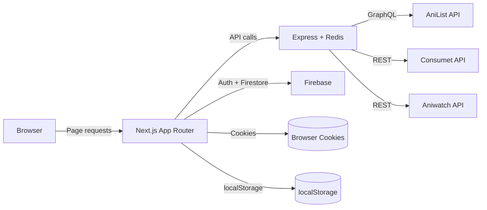

**AniProject Flow Notes (Repo Scan)**

This document is a repo-derived map of how the project works, with a focus on API, UI/UX, data flow, and background images. It is based only on the code in this workspace.

**High-Level Architecture**

The project is split into a Next.js frontend and a Node/Express backend. The frontend is the UI and most page-level orchestration. The backend is a thin caching/proxy layer that talks to external APIs. User state and preferences live in Firebase (Auth + Firestore), and temporary state lives in cookies and localStorage.

Mermaid map of the data flow:

Key roots:

- `frontend/app` is the UI and page flow. The App Router uses server components for most pages.
- `backend` is the API server with Redis caching and routes under `/search`, `/media-info`, `/medias`, `/episodes`, `/chapters`, `/news`, `/imdb`.
- External APIs: AniList (metadata + user lists), Consumet (Zoro/Gogoanime, Mangadex, ANN news, TMDB/IMDB), Aniwatch (streams + episodes).

**Runtime Components and Responsibilities**

Frontend (Next.js):

- UI and routing, server-side data fetches, and rendering.
- Uses cookies to store user settings like title language and adult content. Cookies are read by middleware to inject auth headers and URL params.
- Fetches metadata through the backend (AniList GraphQL), and streams/chapters through the backend (Consumet + Aniwatch APIs).
- Uses Firebase for login and Firestore for user data like bookmarks, watched episodes, notifications, and preferences.
- Uses Redux for in-memory UI state like the current user and login modal.

Backend (Express + Redis):

- Proxy/cache for AniList, Consumet, Aniwatch, and TMDB/IMDB.
- Adds Redis caching to reduce API calls. Cache keys are based on query params.
- No auth logic here, just request forwarding and caching.

Data Stores:

- Redis cache in backend with TTL from `REDIS_EXPIRATION`.
- Firebase Auth for Google/Email/Anonymous logins, and AniList OAuth handled via frontend + middleware.
- Firestore collections like `users`, `comments` (deprecated), and `notifications`.

**Backend API Endpoints (Proxy + Cache)**

Base server entry: `backend/server.js` mounts routes under `/search`, `/media-info`, `/medias`, `/episodes`, `/chapters`, `/news`, `/imdb`.

Search endpoints:

| Endpoint | Purpose | Key Params | Source | Code |
|---|---|---|---|---|
| `GET /search/any/anilist` | AniList search for anime or manga | `query`, `showAdultContent`, `type`, `format`, `sort`, `season`, `seasonYear`, `page`, `perPage`, `authToken` | AniList GraphQL | `backend/routes/searchRoute.js`, `backend/controllers/search/anilist/searchController.js` |
| `GET /search/anime/anilist` | AniList anime search | same as above | AniList GraphQL | same as above |
| `GET /search/anime/aniwatch` | Aniwatch search | `query` | Aniwatch API | `backend/controllers/search/aniwatch/searchController.js` |
| `GET /search/anime/consumet/zoro` | Zoro search | `query` | Consumet (Zoro) | `backend/controllers/search/consumet/zoro/searchController.js` |
| `GET /search/anime/consumet/gogoanime` | Gogoanime search | `query` | Consumet (Gogoanime) | `backend/controllers/search/consumet/gogoanime/searchController.js` |
| `GET /search/media/anime-database` | Offline JSON database filter | `type`, `title`, `genre`, `year`, `status`, `page`, `sort`, `season` | Local JSON | `backend/controllers/search/anime-database/searchController.js` |
| `GET /search/manga/consumet/mangadex/:query` | Mangadex search | `query` in path | Consumet (Mangadex) | `backend/controllers/search/consumet/mangadex/searchController.js` |

Media info endpoints:

| Endpoint | Purpose | Key Params | Source | Code |
|---|---|---|---|---|
| `GET /media-info/anime/anilist` | Full media metadata by AniList ID | `query` (id), `authToken` | AniList GraphQL | `backend/controllers/mediaInfo/anilist/mediaInfoController.js` |
| `GET /media-info/anime/consumet/zoro` | Zoro media info | `query` (id) | Consumet | `backend/controllers/mediaInfo/consumet/zoro/mediaInfoController.js` |
| `GET /media-info/anime/consumet/gogoanime` | Gogoanime media info | `query` (id) | Consumet | `backend/controllers/mediaInfo/consumet/gogoanime/mediaInfoController.js` |

Browse endpoints:

| Endpoint | Purpose | Key Params | Source | Code |
|---|---|---|---|---|
| `GET /medias/anime/:format?` | AniList media by type/format | `page`, `perPage`, `sort`, `season`, `seasonYear`, `showAdultContent`, `status`, `releasedOnLastXDays` | AniList GraphQL | `backend/controllers/medias/anilist/mediasByParamsController.js` |
| `GET /medias/manga/:format?` | Same as above | same as above | AniList GraphQL | same as above |
| `GET /medias/movie/:format?` | Same as above | same as above | AniList GraphQL | same as above |
| `GET /medias/latest-releases` | Recently released by date range | `releasedOnLastXDays`, `showOnlyReleasesOnThisDate` | AniList GraphQL | same as above |
| `GET /medias/trending` | Trending list | `sort`, `perPage` | AniList GraphQL | same as above |

Streaming endpoints:

| Endpoint | Purpose | Key Params | Source | Code |
|---|---|---|---|---|
| `GET /episodes/aniwatch/all` | Episode list for Aniwatch anime | `id` | Aniwatch API | `backend/controllers/episodes/aniwatch/episodesController.js` |
| `GET /episodes/aniwatch/episode` | Stream sources for an episode | `id`, `category` (sub/dub), `server` | Aniwatch API | same as above |
| `GET /episodes/consumet/gogoanime/all` | Episode list (Gogoanime) | `id` | Consumet | `backend/controllers/episodes/consumet/gogoanime/episodesController.js` |
| `GET /episodes/consumet/gogoanime/episode` | Stream sources (Gogoanime) | `id` | Consumet | same as above |
| `GET /episodes/consumet/zoro/all` | Episode list (Zoro) | `id` | Consumet | `backend/controllers/episodes/consumet/zoro/episodesController.js` |
| `GET /episodes/consumet/zoro/episode` | Stream sources (Zoro) | `id` | Consumet | same as above |

Manga endpoints:

| Endpoint | Purpose | Key Params | Source | Code |
|---|---|---|---|---|
| `GET /chapters/consumet/mangadex/all` | Chapter list for manga | `id` | Consumet | `backend/controllers/chapters/consumet/mangadex/chaptersController.js` |
| `GET /chapters/consumet/mangadex/chapter` | Chapter pages | `id` | Consumet | same as above |

News endpoints:

| Endpoint | Purpose | Key Params | Source | Code |
|---|---|---|---|---|
| `GET /news/consumet/ann/all` | ANN recent feeds | `topic` | Consumet | `backend/controllers/news/consumet/animeNewsNetwork/allNewsController.js` |
| `GET /news/consumet/ann` | ANN article by id | `id` | Consumet | `backend/controllers/news/consumet/animeNewsNetwork/newsByIdController.js` |

IMDB/TMDB endpoints:

| Endpoint | Purpose | Key Params | Source | Code |
|---|---|---|---|---|
| `GET /imdb/search` | Search by title | `query` | Consumet `meta/tmdb` | `backend/controllers/imdb/consumet/imdbController.js` |
| `GET /imdb/media-info` | Details by id | `query`, `type` | Consumet `meta/tmdb` | same as above |

**Frontend Data Access Layer (API wrappers)**

These files wrap backend endpoints and are used in pages/components.

- AniList metadata and lists: `frontend/app/api/anilist/anilistMedias.ts` and `frontend/app/api/anilist/anilistUsers.ts`.
- Media info: `frontend/app/api/mediaInfo/anilist/mediaInfo.ts`.
- Consumet search and info: `frontend/app/api/search/consumet/search.ts`, `frontend/app/api/mediaInfo/consumet/mediaInfo.ts`.
- Aniwatch search and episodes: `frontend/app/api/search/aniwatch/search.ts`, `frontend/app/api/episodes/aniwatch/episodesInfo.ts`.
- Consumet streaming episodes: `frontend/app/api/episodes/consumet/episodesInfo.ts`.
- Manga: `frontend/app/api/consumet/consumetManga.ts`.
- News: `frontend/app/api/consumet/consumetNews.ts`.
- IMDB/TMDB: `frontend/app/api/consumet/consumetImdb.ts`.

**Page Flow by Route (UI + Data)**

**Home Page (`/`)**

1. Server component in `frontend/app/page.tsx` pulls lists from AniList via backend.
2. Hero carousel uses banner images on desktop and extra-large covers on mobile in `frontend/app/components/HomePage/HeroCarouselHomePage/index.tsx`.
3. Sections are assembled from different sorts (trending, releasing, favourites, latest, etc.) and rendered using reusable media cards and carousels.
4. Keeps a “Keep Watching” section using Firestore data from `frontend/app/components/HomePage/KeepWatchingSection/index.tsx`.

**Search Page (`/search`)**

1. Server component in `frontend/app/search/page.tsx` queries the offline anime database via backend.
2. Filters are in a sidebar that manipulates URL query params with `useSearchParams` in `frontend/app/search/components/NavigationSideBar/index.tsx`.
3. Results load in batches by incrementing `page` in URL and re-fetching in `frontend/app/search/components/ResultsContainer/index.tsx`.

**Media Details (`/media/[id]`)**

1. Server component `frontend/app/media/[id]/page.tsx` fetches AniList media metadata and IMDB/TMDB info.
2. Title language is controlled by cookie `media_title_language`, injected as `?lang=` by middleware in `frontend/middleware.ts`.
3. Background banner is chosen from AniList `bannerImage` or IMDB cover.
4. Shows cast, description, related media, reviews, and episodes or chapters depending on type.
5. Episodes list pulls from streaming sources, and chapters list pulls from Mangadex.
6. Adds “Add to List”, “Add to Favorites”, and “Notify” buttons.

**Watch Page (`/watch/[id]`)**

1. Server component `frontend/app/watch/[id]/page.tsx` loads AniList info and chooses a stream source based on query params.
2. Query params include `source`, `episode`, `q` (episode id), `t` (last time), `dub`.
3. Stream sources are fetched by `frontend/app/watch/[id]/fetchFunctions.ts`, which uses optimized matching in `frontend/app/lib/dataFetch/optimizedFetchAnimeOptions.ts`.
4. Mismatch detection compares episode ids and can block playback unless the cookie `wrong_media_enabled` is true. This check is enforced in `frontend/middleware.ts` and `compareEpisodeIDs`.
5. `VideoPlayer` in `frontend/app/watch/[id]/components/VideoPlayer/index.tsx` uses Vidstack, supports subtitles, auto-skip, auto-next, and writes watch progress into Firestore.

**Read Page (`/read/[id]`)**

1. Server component `frontend/app/read/[id]/page.tsx` fetches AniList metadata and Mangadex chapters/pages.
2. It tries to resolve manga by title slug, then falls back to the closest Mangadex match using `getClosestMangaResultByTitle` in `frontend/app/lib/dataFetch/optimizedFetchMangaOptions.ts`.
3. Chapters are filtered to those with pages, and the reader UI is rendered in `frontend/app/read/[id]/components/ChaptersPages`.

**News (`/news` and `/news/[date]/[newsTitle]/[id]`)**

1. `frontend/app/news/page.tsx` pulls categories from ANN via backend and renders large hero cards and carousels.
2. `frontend/app/news/[date]/[newsTitle]/[id]/page.tsx` fetches a single article by id and shows related news.

**Favourites and Lists**

- `/favourites` shows user bookmarks from Firestore and uses a sidebar and sort controls.
- `/my-lists` uses AniList lists via `frontend/app/api/anilist/anilistUsers.ts`.

**UI/UX System and Layout**

Global look and feel:

- Color system and font scale defined in `frontend/app/globals.css`.
- Main color direction is deep teal/blue background with bright pink accent.
- Uses consistent button radius and grid spacing tokens.

Header and navigation:

- Header layout in `frontend/app/layout/header/index.tsx` with hover menus for anime, manga, and news.
- Hover menus use live data and embed trailers in `frontend/app/layout/header/components/AnimeNavListHover/index.tsx`.
- Search is a header dropdown with animated results, `frontend/app/layout/header/components/SearchFormContainer/index.tsx`.

Hero carousel:

- Uses Framer Motion for slide animation and Swiper for list previews in `frontend/app/components/HomePage/HeroCarouselHomePage/index.tsx`.
- Desktop uses banner images; mobile uses cover images.
- Autoplay trailer is stored in localStorage as `autoPlayTrailer`.

Media cards:

- Standard card components in `frontend/app/components/MediaCards/MediaCard/index.tsx`.
- Uses Next Image with blur placeholders and type icons.
- Inline action buttons allow adding to lists, favourites, and notifications.

Video player UX:

- Vidstack player with custom overlay controls in `frontend/app/watch/[id]/components/VideoPlayer/index.tsx`.
- Subtitles selection is based on user preference cookie `subtitle_language`.
- “Auto skip intro/outro” and “auto next episode” come from Firestore user doc.
- “Keep Watching” list is updated and surfaced on Home page.

Reader UX:

- Chapter pages are displayed with a clean vertical flow in `frontend/app/read/[id]/components/ChaptersPages`.
- A chapter list panel is on the same page for quick navigation.

**How HD Backgrounds Are Built Today**

Current background logic:

- Home hero uses AniList `bannerImage` for desktop and `coverImage.extraLarge` for mobile in `frontend/app/components/HomePage/HeroCarouselHomePage/index.tsx`.
- Media page uses `bannerImage` and falls back to IMDB cover in `frontend/app/media/[id]/page.tsx`.
- Backgrounds are applied as CSS `background` with `cover` size and gradients in `frontend/app/page.module.css` and `frontend/app/media/[id]/page.module.css`.

If you want higher quality or more consistent HD:

- Prefer `coverImage.extraLarge` and `bannerImage` from AniList everywhere and avoid lower resolutions.
- Consider using an absolutely positioned `next/image` with `fill` and `quality={100}` for backgrounds instead of raw CSS `background` so you get Next’s image optimization.
- Store multiple sources (AniList banner, AniList cover, TMDB backdrops) and pick the highest resolution. The current flow already mixes AniList and IMDB; expanding to backdrops is a natural upgrade.
- Keep the gradient overlay to preserve text readability. The project already uses `linear-gradient(..., var(--background) ...)` for this.

**Auth, Cookies, and User Preferences**

Auth options:

- Firebase Auth: Google, Email/Password, Anonymous. Anilist OAuth for enhanced experience.
- OAuth token is stored in an httpOnly cookie via `frontend/app/api/anilist/route.ts`.
- `frontend/middleware.ts` injects `Authorization` header and handles title language and wrong-media alerts.

User settings storage:

- Cookies are set via API routes: `frontend/app/api/media-title-language/route.ts`, `frontend/app/api/adult-content/route.ts`, `frontend/app/api/subtitle/route.ts`, `frontend/app/api/wrong-media-enabled/route.ts`.
- Firestore user docs include settings like `videoSource`, `videoQuality`, `autoNextEpisode`, `autoSkipIntroAndOutro`, and lists like `bookmarks`, `keepWatching`, and `episodesWatched`.
- AniList settings are updated through GraphQL mutations in `frontend/app/api/anilist/anilistUsers.ts` and mirrored in cookies.

**Caching and Performance**

- Backend caches most calls in Redis using keys derived from route + params, and uses `REDIS_EXPIRATION` for TTL.
- Next.js pages use `export const revalidate` for news, watch, and read pages.
- Client-side caching is light; the UI relies on backend Redis and Next server caching.
- A service worker is registered via `frontend/public/register-sw.ts`, but `frontend/public/sw.ts` is effectively a no-op, so there is no real offline cache today.

**Metadata, Stream, and Manga APIs in the UI**

Metadata (AniList):

- Search and browse: `frontend/app/api/anilist/anilistMedias.ts` -> backend `/search` and `/medias`.
- Media details: `frontend/app/api/mediaInfo/anilist/mediaInfo.ts` -> backend `/media-info/anime/anilist`.
- Lists and user data: `frontend/app/api/anilist/anilistUsers.ts`.

Streams (Aniwatch + Consumet):

- Episode lists and sources pulled from `/episodes/aniwatch/*` and `/episodes/consumet/*`.
- `frontend/app/watch/[id]/fetchFunctions.ts` chooses source and matches episodes.
- `VideoPlayer` loads the final stream URL and manages playback state.

Manga (Mangadex via Consumet):

- Search and chapters via `/search/manga/consumet/mangadex/:query` and `/chapters/consumet/mangadex/*`.
- `frontend/app/read/[id]/page.tsx` resolves the best Mangadex id and then fetches chapters and pages.

**Key Requirements and Config**

Frontend requirements are documented in `frontend/README.md` and include:

- AniList OAuth client id and secret.
- Firebase config keys for Auth + Firestore.
- `NEXT_PUBLIC_BACKEND_URL` pointing to the backend server.
- `NEXT_PUBLIC_ANILIST_API_URL` for direct AniList GraphQL calls.
- `NEXT_PUBLIC_WEBSITE_ORIGIN_URL` used for cookie-setting API routes.

Backend requirements are documented in `backend/README.md` and include:

- Consumet and Aniwatch API base URLs.
- Redis credentials and TTL.
- AniList API base URL and OAuth client/secret.
- `DEV_MODE` toggles local vs hosted Redis connection.

**If You Want To Rebuild or Clone the UI**

Use these files as primary references:

- Layout and global theme: `frontend/app/layout.tsx`, `frontend/app/globals.css`.
- Header, search, nav hovers: `frontend/app/layout/header/*`.
- Home hero, carousels, sections: `frontend/app/components/HomePage/*`.
- Media cards and action buttons: `frontend/app/components/MediaCards/*` and `frontend/app/components/Buttons/*`.
- Media detail page and section layout: `frontend/app/media/[id]/*`.
- Watch page and player: `frontend/app/watch/[id]/*`.
- Read page and reader: `frontend/app/read/[id]/*`.
- News UI: `frontend/app/news/*`.
